  

  
  
  
  
  

> 🌐 **The Definitive 2026 Guide & Curated List of SaaS Platforms & Open-Source IoT Device Triggering Ecosystems**  
> ⚡ *Focused on Button-Triggered Actions, Event-Driven Automation, Cellular IoT, & Self-Hosted IoT Platforms.*

---

## 📌 Overview

This repository tracks notable **commercial IoT device triggering platforms** and **open-source GitHub projects** that empower physical hardware — smart buttons, sensors, GPS trackers, and microcontrollers — to trigger remote cloud actions, send real-time alerts, and automate workflows with minimal or zero custom code.

Whether you're building a 1-click panic button 🚨, automated environmental monitoring 🌡️, cellular asset tracking 📡, or a local smart home network 🏠, this list compares pricing 💰, free tiers 🎁, company scale 📈, open-source Stars_Counts ⭐, and feature sets across the entire IoT automation landscape.

---

## 📑 Table of Contents

- [📊 Market Overview & Ecosystem Insights](#-market-overview--ecosystem-insights)
- [☁️ SaaS & Commercial Hosted Platforms](#️-saas--commercial-hosted-platforms)
- [🛠️ Open-Source GitHub Projects](#️-open-source-github-projects)
  - [📋 Open-Source Comparison Table](#-open-source-comparison-table)
  - [🔎 Detailed Open-Source Project Breakdowns](#-detailed-open-source-project-breakdowns)
- [💡 Frameworks & Architecture Recommendations](#-frameworks--architecture-recommendations)
- [🤝 How to Contribute](#-how-to-contribute)
- [💖 Support & Sponsorship](#-support--sponsorship)
- [⚖️ Disclaimer & Security Considerations](#️-disclaimer--security-considerations)
- [⭐ Star History](#-star-history)

---

## 📊 Market Overview & Ecosystem Insights

> 📈 **Estimated Market Size**: The global IoT Platform and Device Management market is valued at approximately **$12.5 Billion** and is projected to expand to **$35+ Billion by 2030** (CAGR ~16.5%).  
> 🧩 **Market Fragmentation**: The sector is **highly fragmented**, featuring enterprise hyperscalers (AWS), specialized cellular MVNO platforms (Hologram, Twilio), low-code maker platforms (Blynk, Adafruit IO), and massive open-source rule engines (ThingsBoard, Home Assistant, Node-RED). No single provider holds a monopoly; choice depends on hardware integration, local vs. cloud control, and deployment scale.

---

## ☁️ SaaS & Commercial Hosted Platforms

The table below lists leading commercial IoT triggering and device management platforms, sorted by **Company Size / Valuation / Revenue (descending)** 🏆.

| Product / Platform | Focus & Key Capabilities | Starting Tier Pricing | Free Tier Limit | Company Size / Valuation / Revenue |
| :--- | :--- | :--- | :--- | :--- |
| 🔴 **[AWS IoT 1-Click](https://aws.amazon.com/iot-1-click/)** / **[AWS IoT Core](https://aws.amazon.com/iot-core/)** | Enterprise button triggering & AWS Lambda / SMS integration with 1-click deployment. ⚡ | **$0.25 / month** per active button or **$1.00 / million** messages | **250,000 free messages / month** for 12 months (AWS Free Tier) 🎁 | **~$2.1 Trillion** (Market Cap - Amazon.com Inc.) 🏢 |
| 🔴 **[Twilio IoT](https://www.twilio.com/iot)** | Global cellular SIM connectivity (Super SIM) and programmable wireless device triggers. 📲 | **$2.00 / SIM / month** + $0.10 / MB data | **$15.00 free credit** upon account registration 🎁 | **~$11.5 Billion** (Market Cap - Twilio Inc.) 🏢 |
| 🔴 **[Hologram](https://www.hologram.io/)** | Global cellular IoT SIM connectivity, automated network switching, & webhooks. 📶 | **$1.50 / SIM / month** + $0.40 / MB data | **1st SIM free** with 1 MB / month data free forever 🎁 | **~$300 Million** Valuation ($80M+ total funding raised) 🏢 |
| 🔴 **[Particle Cloud](https://www.particle.io/)** | All-in-one cellular & Wi-Fi IoT device hardware, cloud OS, OTA updates, & trigger webhooks. ⚡ | **$299.00 / month** (Growth Plan up to 100 devices) | **100 devices & 100k data ops / month** free forever (Sandbox Plan) 🎁 | **~$200 Million** Valuation ($80M+ total funding raised) 🏢 |
| 🔴 **[Arduino Cloud](https://cloud.arduino.cc/)** | Official Arduino web editor, cloud dashboards, trigger rules, & OTA firmware updates. 🤖 | **$2.99 / month** (Entry Plan) or $6.99 / month (Junior Plan) | **2 devices & 1-day data retention** free forever 🎁 | **~$100 Million+** Valuation ($54M Series B led by Bosch) 🏢 |
| 🔴 **[Adafruit IO](https://io.adafruit.com/)** | Maker-focused MQTT/HTTP data logging, visual dashboards, and automated trigger feeds. 🍓 | **$9.99 / month** or $99.00 / year (Adafruit IO Plus) | **30 data points/min & 10 feeds** free forever (30-day storage) 🎁 | **~$45 Million** Annual Revenue (100% Bootstrapped) 🏢 |
| 🔴 **[Losant](https://www.losant.com/)** | Enterprise IoT application platform with visual workflow engine & edge compute triggers. ⚙️ | **$150.00 / month** (Developer / Starter Package) | **10 devices & 1,000,000 payloads / month** (Developer Sandbox) 🎁 | **~$20 Million** Revenue ($15M+ total venture funding) 🏢 |
| 🔴 **[ThingsBoard Cloud](https://thingsboard.io/)** | Managed SaaS edition of ThingsBoard open-source IoT platform with rule chains & alerts. 📊 | **$10.00 / month** (Maker Plan for up to 30 devices) | **30-day free trial** (up to 30 devices & full platform features) 🎁 | **~$10 Million** Revenue (Commercial entity behind Open Source) 🏢 |
| 🔴 **[Ubidots](https://ubidots.com/)** | Industrial IoT & low-code app engine, data visualization, and event notification rules. 📈 | **$49.00 / month** (STEM / Business Starter for 20 devices) | **3 devices & 30-day data retention** free forever (STEM Plan) 🎁 | **~$10 Million** Revenue (Bootstrapped & Profitable) 🏢 |
| 🔴 **[Blynk](https://blynk.io/)** | Drag-and-drop IoT mobile app builder, device management, and event-based triggers. 📱 | **$6.99 / month** (Plus Plan) or $19.00 / month (PRO Plan) | **5 devices, 1 user, 30 widgets** free forever (Blynk Free Plan) 🎁 | **~$8 Million** Revenue (Venture Funded) 🏢 |

---

## 🛠️ Open-Source GitHub Projects

Open-source repositories dominate local device control, MQTT brokering, and home automation rule engines 🔓.

### 📋 Open-Source Comparison Table

Repositories are sorted by **GitHub Stars_Count (descending)** ⭐. Stars_Badges link directly to each repository's official GitHub Stargazers page 🌟.

| Repository / Project | GitHub_Stars | License | Primary Category | Description & Best For |
| :--- | :---: | :---: | :--- | :--- |
| 🟢 **[Home Assistant](https://github.com/home-assistant/core)** |  | Apache-2.0 | Home Automation 🏠 | The leading local-first smart home platform. Automations and scripts triggered by devices, MQTT, or events with 2000+ integrations. |
| 🟢 **[ESPHome](https://github.com/esphome/esphome)** |  | MIT | Firmware / Edge ⚡ | YAML-configured firmware for ESP8266/ESP32 devices. Zero C++ programming required. Native Home Assistant integration. |
| 🟢 **[Tasmota](https://github.com/arendst/Tasmota)** |  | GPL-3.0 | Firmware / Edge 🔌 | Alternative firmware for ESP8266/ESP32 smart plugs and switches with local Web UI, MQTT, and HTTP control. |
| 🟢 **[Node-RED](https://github.com/node-red/node-red)** |  | Apache-2.0 | Flow Automation 🔄 | Low-code flow-based programming tool for event-driven IoT applications and visual API integration. |
| 🟢 **[MicroPython](https://github.com/micropython/micropython)** |  | MIT | Microcontroller OS 🐍 | Lean Python 3 implementation optimized for microcontrollers (ESP32, RP2040, STM32) enabling quick trigger scripts. |
| 🟢 **[ThingsBoard](https://github.com/thingsboard/thingsboard)** |  | Apache-2.0 | IoT Platform 📊 | The leading open-source enterprise IoT platform. Features Rule Engine, device management, dashboards, and MQTT/CoAP/HTTP support. |
| 🟢 **[ESP-IDF](https://github.com/espressif/esp-idf)** |  | Apache-2.0 | SDK / Framework 🛠️ | Official IoT development framework for Espressif ESP32 chip family for professional embedded applications. |
| 🟢 **[EMQX](https://github.com/emqx/emqx)** |  | Apache-2.0 | MQTT Broker 📡 | Ultra-scalable distributed MQTT message broker capable of handling 100M+ concurrent IoT device connections. |
| 🟢 **[Zigbee2MQTT](https://github.com/Koenkk/zigbee2mqtt)** |  | GPL-3.0 | Protocol Gateway 📶 | Bridges Zigbee devices directly to MQTT networks without vendor cloud lock-in. Supports 3000+ devices. |
| 🟢 **[Mosquitto](https://github.com/eclipse/mosquitto)** |  | EPL-2.0 / EDP-1.0 | MQTT Broker 🦟 | Lightweight reference open-source MQTT message broker ideal for embedded single-board computers like Raspberry Pi. |
| 🟢 **[OpenHAB](https://github.com/openhab/openhab-core)** |  | EPL-2.0 | Home Automation 🏡 | Vendor-agnostic open-source home automation system with rule engine and extensive device abstractions. |
| 🟢 **[ioBroker](https://github.com/ioBroker/ioBroker)** |  | MIT | IoT Platform 🧩 | Modular Node.js IoT integration platform designed for connecting diverse smart devices and automated triggers. |
| 🟢 **[Domoticz](https://github.com/domoticz/domoticz)** |  | GPL-3.0 | Home Automation ⚙️ | Lightweight C++ home automation system designed for low-power hardware with built-in rule engine. |
| 🟢 **[PlatformIO Core](https://github.com/platformio/platformio-core)** |  | Apache-2.0 | Dev Environment 🧰 | Cross-platform build system and library manager for IoT embedded device microcontrollers. |
| 🟢 **[VerneMQ](https://github.com/vernemq/vernemq)** |  | Apache-2.0 | MQTT Broker ⚡ | High-performance, distributed MQTT message broker designed for high-availability enterprise clustering. |
| 🟢 **[EdgeX Foundry](https://github.com/edgexfoundry/edgex-go)** |  | Apache-2.0 | Edge Computing 🏭 | Vendor-neutral open-source edge IoT framework hosted by the Linux Foundation for industrial IoT edge processing. |
| 🟢 **[MySensors](https://github.com/mysensors/MySensors)** |  | GPL-2.0 | Sensor Network 📻 | Open-source hardware & software framework for building DIY wireless sensor mesh networks. |
| 🟢 **[Arduino Core AVR](https://github.com/arduino/ArduinoCore-avr)** |  | LGPL-2.1 | Core SDK 🧩 | Official Arduino core for ATmega microcontrollers powering traditional Arduino boards. |
| 🟢 **[Magistrala (Mainflux)](https://github.com/absmach/magistrala)** |  | Apache-2.0 | Industrial IoT 🏗️ | Cloud-native, microservices-based industrial IoT platform for telemetry, management, and workflow triggers. |
| 🟢 **[Node Z-Wave JS](https://github.com/zwave-js/node-zwave-js)** |  | MIT | Protocol Gateway 🗝️ | Fully open-source JavaScript Z-Wave driver for controlling Z-Wave sensors and triggers via MQTT or APIs. |
| 🟢 **[NanoMQ](https://github.com/nanomq/nanomq)** |  | MIT | Edge Broker 🔹 | Ultra-lightweight actor-based MQTT broker tailored for edge gateways and resource-constrained devices. |
| 🟢 **[ThingsBoard Edge](https://github.com/thingsboard/thingsboard-edge)** |  | Apache-2.0 | Edge Compute 🌐 | Edge computing engine for local rule processing, offline event storage, and seamless sync with ThingsBoard Cloud. |

---

### 🔎 Detailed Open-Source Project Breakdowns

#### 1. Home Automation & Rule Engines 🏠
- **[Home Assistant](https://github.com/home-assistant/core)**:  — Features local control, YAML and visual automations, companion mobile apps, and thousands of community integrations.
- **[Node-RED](https://github.com/node-red/node-red)**:  — Excellent for visual wiring of IoT hardware, webhooks, database logging, and REST APIs.
- **[OpenHAB](https://github.com/openhab/openhab-core)**:  — Strong enterprise Java architecture with modular bindings for legacy and modern smart protocols.

#### 2. Open-Source IoT Platforms 📊
- **[ThingsBoard](https://github.com/thingsboard/thingsboard)**:  — Full-featured self-hosted alternative to AWS IoT. Includes rule chains, multi-tenant RBAC, alarms, and telemetry charts.
- **[Magistrala (formerly Mainflux)](https://github.com/absmach/magistrala)**:  — Modern Go-based IoT framework with containerized microservices and zero-trust security.

#### 3. Firmware & Hardware Frameworks ⚡
- **[ESPHome](https://github.com/esphome/esphome)**:  — Write configuration in clean YAML; compiles optimized C++ binaries for ESP32/ESP8266.
- **[Tasmota](https://github.com/arendst/Tasmota)**:  — Pre-compiled firmware binaries for quick flashing onto commercially available Wi-Fi smart switches.
- **[MicroPython](https://github.com/micropython/micropython)**:  — Standard interactive Python REPL on microcontrollers with low memory footprints.

#### 4. Messaging & Connectivity Protocols 📡
- **[EMQX](https://github.com/emqx/emqx)**:  — Erlang-based enterprise MQTT broker designed for high throughput and zero downtime.
- **[Mosquitto](https://github.com/eclipse/mosquitto)**:  — Industry standard lightweight MQTT v5.0/v3.1.1 broker written in C.
- **[Zigbee2MQTT](https://github.com/Koenkk/zigbee2mqtt)**:  — Converts physical Zigbee signals directly to standard JSON payloads over MQTT.

---

## 💡 Frameworks & Architecture Recommendations

When designing an IoT device triggering workflow, consider the following standard architectures 🏗️:

1. **Enterprise Cloud Deployment** ☁️:
   - Combine **ThingsBoard** for multi-tenant device management, visual rule chains, and data telemetry.
   - Route high-volume telemetry through **EMQX** or **Mosquitto** MQTT brokers.
2. **Local Smart Home & DIY** 🏠:
   - Flash ESP32 hardware using **ESPHome** or **Tasmota**.
   - Bridge hardware events using **Zigbee2MQTT** to **Home Assistant** or **Node-RED**.
3. **Cellular Remote Hardware** 📡:
   - Utilize **Hologram** or **Twilio Super SIM** for global fallback connectivity.
   - Use **Particle Cloud** or **AWS IoT Core** for direct webhooks and low-latency cloud actions.

---

## 🤝 How to Contribute

1. **Fork** the repository 🍴.
2. Add or update entries in `README.md` keeping descriptions factual, concise, and structured 📝.
3. Ensure pricing, free tiers, and Stars_Badges are accurately updated 🔄.
4. Submit a **Pull Request** with a brief summary of the changes 🚀.

---

## 💖 Support & Sponsorship

If you find this curated IoT device triggering list helpful for your projects, smart home setup, or enterprise research, please consider supporting the project! 🌟

- ⭐️ **Star this repository** on GitHub to help increase its visibility!
- 🔀 **Fork & Share** it with your fellow makers, IoT engineers, and hardware hackers.
- ☕ **Sponsor / Buy me a coffee**: Support ongoing maintenance and curated ecosystem updates via [GitHub Sponsors](https://github.com/sponsors/ishandutta2007).

  

---

## ⚖️ Disclaimer & Security Considerations

- 🔒 **Security Requirements**: IoT devices and exposed MQTT brokers can be vulnerable to unauthorized access. Always secure deployments with TLS/SSL encryption, disable default passwords, and isolate IoT VLANs.
- 🛡️ **Data Privacy & Compliance**: Ensure self-hosted platforms adhere to relevant local data compliance regulations (GDPR, CCPA) when storing sensor log data.
- ⚠️ **Hardware Fail-safes**: Rule engines controlling physical actuators or high-power relays should include hardcoded physical safety limits and fail-safe interlocks.
- 📱 **Cellular Plans**: Cellular data plans are subject to carrier charges; test bandwidth limits during development using developer SIM tiers.

---

## ⭐ Star History

---

Made with ❤️ for makers, hardware hackers, and IoT engineers worldwide. 🌐

